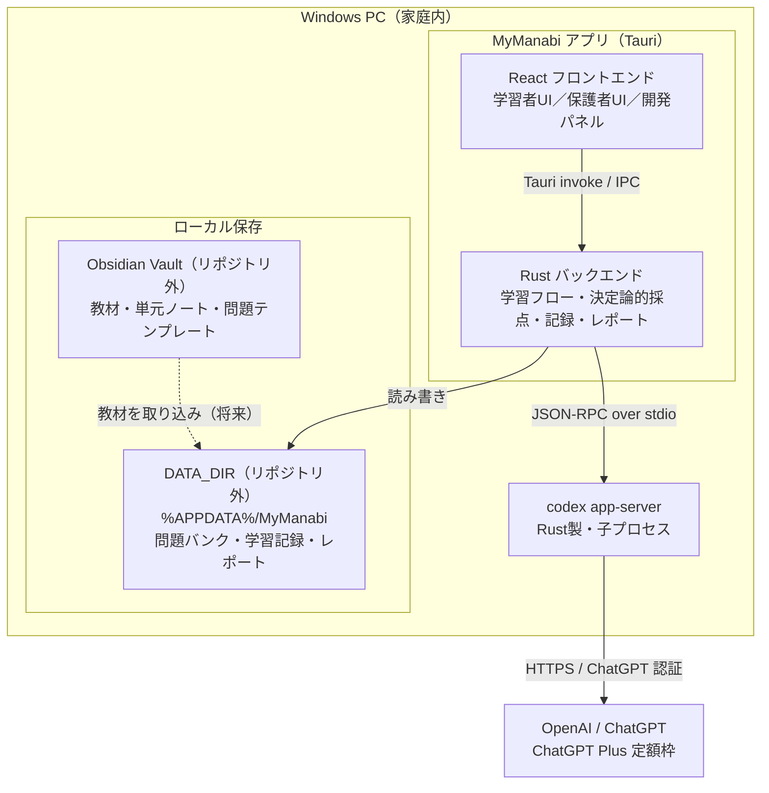
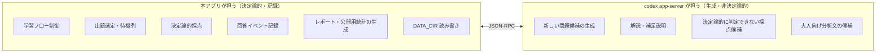
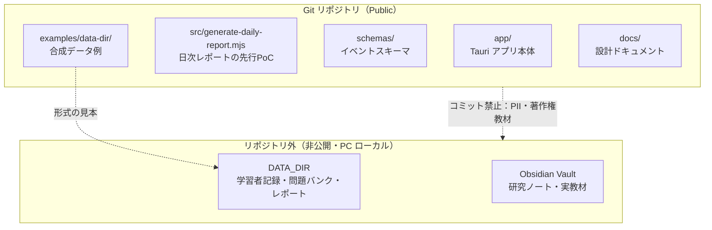
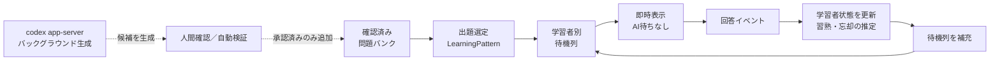
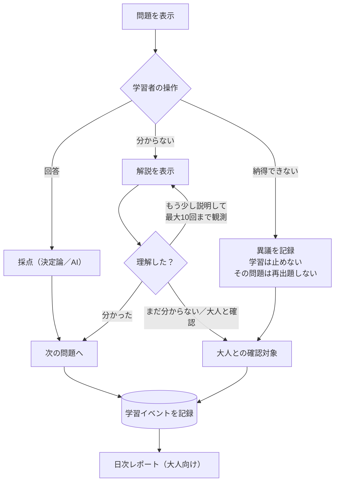
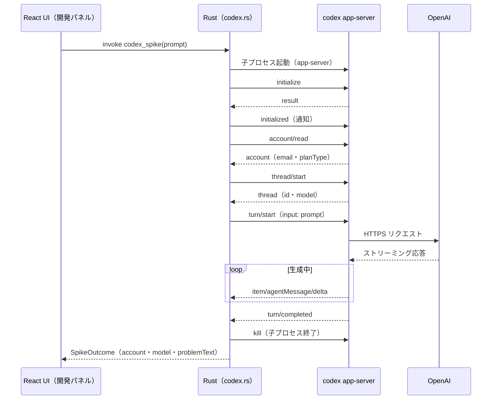
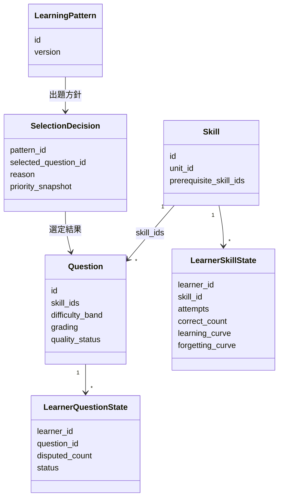
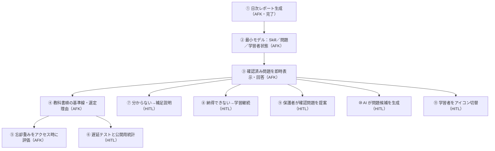

# アーキテクチャ概要

MyManabi の全体構成・責務分担・データ配置・主要フローを図で示す。

背景や方針は [コンセプト](concept/README.md)、具体仕様は [仕様](spec/README.md)、出題選定の中核ドメインは [ドメイン設計](spec/domain-design.md)、実装順は [初期 PoC ロードマップ](spec/initial-poc-roadmap.md) を参照。

> **状態**: 設計・PoC 段階。現状は「合成イベントからの日次レポート生成（縦切り1）」と「codex app-server 疎通スパイク」が動く。本書の図は、現状と本設計（目標）の両方を含む。各図の「将来／未実装」は破線または注記で示す。

> Mermaid は Obsidian・GitHub の両方で描画できるよう、ノードラベル内のリスト記法を避け、丸数字（①②）を用いる（[AGENTS.md](../AGENTS.md) のルールに準拠）。

---

## 1. システム全体構成

家庭内の Windows PC 上で完結する。本アプリ（Tauri）が AI バックエンド（codex app-server）を子プロセスとして駆動し、データは原則ローカルに保存する。



要点:

- 子ども向け UI は本アプリ（React + Tauri）が新規に持つ。codex は UI を持たない AI バックエンド。
- 本アプリ ↔ codex app-server は **JSON-RPC over stdio**（改行区切り JSON）。
- 学習記録・教材コンテンツは **DATA_DIR**（リポジトリ外）に隔離。教材の入力元は Obsidian Vault。
- 外部送信は codex 経由の OpenAI のみ。ChatGPT Plus の認証・定額枠を使う。

---

## 2. 責務分担（本アプリ ↔ AI）

「決定論的に確定できること」は本アプリ、「生成・非決定論的な判断」は codex、と明確に分ける。これにより採点品質・記録形式・操作性の問題を切り分けやすくする。



AI の出力（生成問題・採点・解説）は「もっともらしく誤る」前提で扱い、AI 判定・人間判定・本人の異議を**分けて記録**する。

---

## 3. データ配置と公開／非公開の境界

リポジトリは Public。**個人情報（学習記録・手書き画像・音声）と著作権教材は絶対にコミットしない**。リポジトリに入れてよいのは合成データとスキーマのみ。



DATA_DIR のたたき台:

```text
<DATA_DIR>/
  content/
    questions/        確認済み問題バンク（approved のみ出題）
    units/  templates/
  learners/
    learner-a/
      events/         一問一行の学習イベント（*.jsonl）
      reports/        日次レポート（YYYY-MM-DD.md）
      media/          手書き画像・音声（合意の上ローカル保存）
    learner-b/ ...
```

- 教材テンプレートは共通領域（`content/`）に置き、学習者別フォルダへ複製しない。
- DATA_DIR の場所は `MYMANABI_DATA_DIR` または既定の `%APPDATA%/MyManabi`。
- AI サービスへの送信時の扱いは利用者側設定に依存（ChatGPT の学習利用オフを必須とする）。

---

## 4. 通常学習の即時応答フロー

子どもへ最初の問題を速く出すため、通常経路は**確認済み問題バンクから即時表示**し、画面表示時に AI 応答を待たない。AI 生成はバックグラウンドで候補を補充する役割に限る。



出題のたびに優先度の**内訳と選定理由**（`SelectionDecision`）を記録し、基準線（教科書順）と新方式を同じ評価プロトコルで比較できるようにする。

---

## 5. 回答時の操作分岐

各問題には通常回答に加えて `分からない` と `納得できない` を用意し、別々に記録する。AI とその場で口論させず、未解決は大人との確認へ渡す。



`分からない` と誤答は分けて保存する（理解できないと明示した場合と、回答して誤った場合では次の対応が異なるため）。

---

## 6. codex app-server の駆動（疎通スパイク）

現状の実装（[app/src-tauri/src/codex.rs](../app/src-tauri/src/codex.rs)）は、接続ごとに app-server を起動し、ハンドシェイク→一問生成→終了する**スパイク**。本実装では長寿命接続・スレッド再利用・ストリーミング・失敗復旧を別の縦切りで追加する。



---

## 7. ドメインモデル

問題固有の属性（学習者によらない）と、学習者ごとに変化する状態を分離する。値オブジェクトと選定方針が、今後の改善とテストの中心になる。



- **値オブジェクト**: `LearningCurve`（習熟）・`ForgettingCurve`（忘却）・`AgingWeight`（時間経過で増す重み）・`PriorityEvaluation`（優先度と内訳）。
- **時間経過だけを理由にした全件バッチ更新はしない**。重みはアクセス時に評価する。
- 保護者関与は `ParentSuggestion`（確認問題の提案）と `ChildResponse`（子の意思表示）で記録する。

---

## 8. 現在の実装ステータス

| 領域 | 現状 | 本設計で追加すること |
|---|---|---|
| フロントエンド | 画面案 A/B・学習者/保護者ビューの throwaway プロトタイプ | 確定版 UI・誤操作防止・学習者アイコン切替 |
| Tauri コマンド | `codex_spike` / `load_question_bank` | 学習フロー・出題選定・記録の各コマンド |
| AI 接続 | 起動→一問生成→終了の疎通スパイク | 長寿命接続・ストリーミング・`model/list` 選択・失敗復旧 |
| 問題バンク | DATA_DIR から `approved` を読み込み | 待機列・優先度評価・選定理由の記録 |
| 学習記録 | 日次レポート PoC（Node, `src/generate-daily-report.mjs`） | Tauri 側へ統合・週次・公開用統計 |
| 学習状態 | 未実装 | Skill・問題・学習者別状態の永続化 |
| 効果測定／保護者関与 | 未実装 | 遅延テスト・公開用統計・`ParentSuggestion`／`ChildResponse` |

---

## 9. 実装順（縦切りの依存関係）

機能を一度に作り込まず、家庭内で試せる小さな縦切りを順に追加する。`AFK` は仕様に沿って自動確認できる項目、`HITL` は家庭での操作感・教育的妥当性を人が確認する項目。


